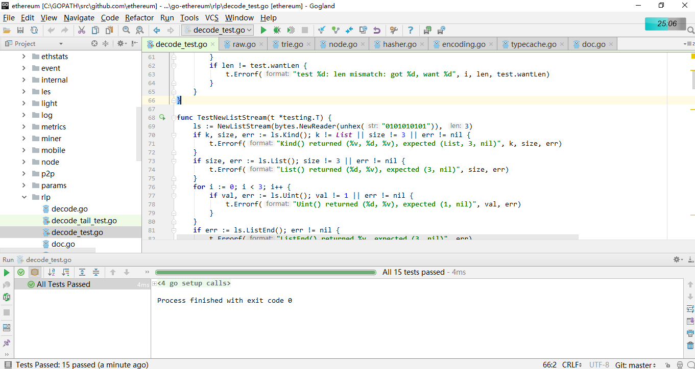

## Go-ethereum source code analysis

Because go ethereum is the most widely used Ethereum client, subsequent source code analysis is analyzed from the code github.

### Build a go ethereum debugging environment

#### windows 10 64bit

First download the go installation package to install, because GO's website is walled, so download it from the address below.

    https://studygolang.com/dl/golang/go1.9.1.windows-amd64.msi

After installation, set the environment variable, add the C:\Go\bin directory to your PATH environment variable, then add a GOPATH environment variable, and set the GOPATH value to the code path of your GO language download (I set it up C:\GOPATH)

Install the git tool, please refer to the tutorial on the network to install the git tool, go language automatically download code from github requires git tool support

Open the command line tool to download the code for go-ethereum  
`go get github.com/ethereum/go-ethereum`

After the command is successfully executed, the code will be downloaded to the following directory, %GOPATH%\src\github.com\ethereum\go-ethereum if it appears during execution

    # github.com/ethereum/go-ethereum/crypto/secp256k1
    exec: "gcc": executable file not found in %PATH%

You need to install the gcc tool, we download and install from the address below

    http://tdm-gcc.tdragon.net/download

Next install the IDE tool. The IDE I use is Gogland from JetBrains. Can be downloaded at the address below

    https://download.jetbrains.com/go/gogland-173.2696.28.exe

Open the IDE after the installation is complete. Select File -> Open -> select GOPATH\src\github.com\ethereum\go-ethereum to open it.

Then open go-ethereum/rlp/decode_test.go. Right-click on the edit box to select Run. If the run is successful, the environment setup is complete.

### Ubuntu 16.04 64bit

Go installation package for installation

    `apt install golang-go git -y`

Golang environment configuration:

_Edit the /etc/profile file and add the following to the file:_

    export GOROOT=/usr/bin/go
    export GOPATH=/root/home/goproject
    export GOBIN=/root/home/goproject/bin
    export GOLIB=/root/home/goproject/
    export PATH=$PATH:$GOBIN:$GOPATH/bin:$GOROOT/bin

Execute the following command to make the environment variable take effect:

# source /etc/profile

Download source code:
#cd /root/home/goproject; mkdir src； cd src # Enter the go project directory, create the src directory, and enter the src directory
#git clone https://github.com/ethereum/go-ethereum

Open it with vim or another IDE, the best is Visual Code

### Go ethereum directory is probably introduced

The organization structure of the go-ethereum project is basically a directory divided by functional modules. The following is a brief introduction to the structure of each directory. Each directory is also a package in the GO language. I understand that the package in Java should be similar. meaning.

    accounts        	Achieved a high-level Ethereum account management
    bmt			Implementation of binary Merkel tree
    build			Mainly some scripts and configurations compiled and built
    cmd			A lot of command line tools, one by one
    	/abigen		Source code generator to convert Ethereum contract definitions into easy to use, compile-time type-safe Go packages
    	/bootnode	Start a node that only implements network discovery
    	/evm		Ethereum virtual machine development tool to provide a configurable, isolated code debugging environment
    	/faucet
    	/geth		Ethereum command line client, the most important tool
    	/p2psim		Provides a tool to simulate the http API
    	/puppeth	Create a new Ethereum network wizard, such as Clique POA consensus
    	/rlpdump 	Provides a formatted output of RLP data
    	/swarm		Swarm network utils
    	/util		Provide some public tools
    	/wnode		This is a simple Whisper node. It can be used as a standalone boot node. In addition, it can be used for different testing and diagnostic purposes.
    common			Provide some public tools
    compression		Package rle implements the run-length encoding used for Ethereum data.
    consensus		Provide some consensus algorithms from Ethereum, such as ethhash, clique(proof-of-authority)
    console			console package
    contracts		Smart contracts deployed in genesis block, such as checkqueue, DAO...
    core			Ethereum's core data structures and algorithms (virtual machines, states, blockchains, Bloom filters)
    crypto			Encryption and hash algorithms
    eth			Implemented the consensus of Ethereum
    ethclient		Provides RPC client for Ethereum
    ethdb			Eth's database (including the actual use of leveldb and the in-memory database for testing)
    ethstats		Provide a report on the status of the network
    event			Handling real-time events
    les			Implemented a lightweight server of Ethereum
    light			Achieve on-demand retrieval for Ethereum lightweight clients
    log			Provide log information that is friendly to humans and computers
    metrics			Provide disk counter, publish to grafana for sample
    miner			Provide block creation and mining in Ethereum
    mobile			Some wrappers used by the mobile side
    node			Ethereum's various types of nodes
    p2p			Ethereum p2p network protocol
    rlp			Ethereum serialization, called recursive length prefix
    rpc			Remote method call, used in APIs and services
    swarm			Swarm network processing
    tests			testing purposes
    trie			Ethereum's important data structure package: trie implements Merkle Patricia Tries.
    whisper			A protocol for the whisper node is provided.

It can be seen that the code of Ethereum is still quite large, but roughly speaking, the code structure is still quite good. I hope to analyze from some relatively independent modules. Then delve into the internal code. The focus may be on modules such as p2p networks that are not covered in the Yellow Book.
